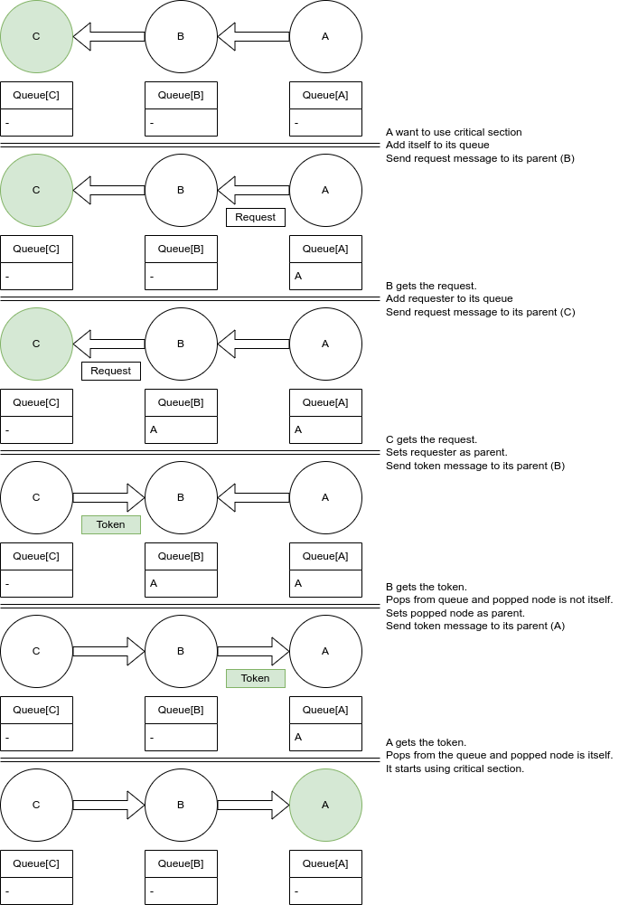
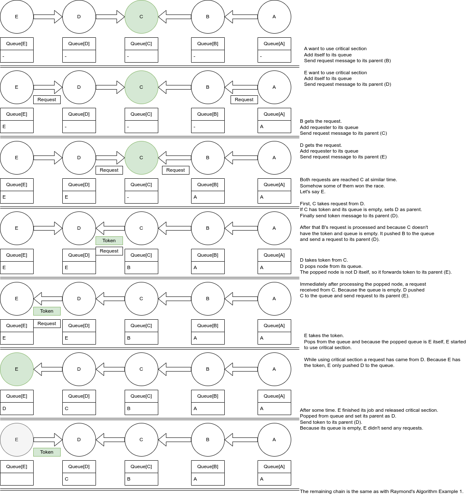

.. include:: substitutions.rst

|DistAlgName|
=========================================

Background and Related Work
~~~~~~~~~~~~~~~~~~~~~~~~~~~~~~

In distributed systems, mutual exclusion is crucial for preventing race conditions, ensuring that only one process can access a critical section at any given time. Unlike single computer systems where shared variables can facilitate mutual exclusion, distributed systems lack shared memory and a common clock, necessitating different solutions.

Requirements for a mutual exclusion algorithm in distributed systems include:

    1. **No Deadlock:** Ensure processes don't indefinitely wait for messages.
    2. **No Starvation:** Every process should have a chance to execute its critical section in finite time.
    3. **Fairness:** Requests to execute critical sections should be executed in the order they arrive.
    4. **Fault Tolerance:** The system should recognize failures and continue functioning without disruption.

Solutions include:

    1. **Token Based Algorithm:** Uses a unique token shared among sites, allowing possession of the token to enter the critical section. Examples include the Suzuki-Kasami Algorithm [SuzukiKasamiAlgorithm]_ and Raymond's Algorithm [RaymondsAlgorithm]_ explained in this document.
    2. **Non-token based approach:** Sites communicate to determine which should execute the critical section next, using timestamps to order requests. Examples include the Ricart-Agrawala Algorithm [RicartAgrawalaAlgorithm]_.
    3. **Quorum based approach:** Sites request permission from a subset called a quorum, ensuring mutual exclusion through common subsets. Examples include Maekawa’s Algorithm [MaekawasAlgorithm]_.

These approaches address the challenges of distributed systems, ensuring safe and efficient access to critical sections while meeting system requirements.

Distributed Algorithm: |DistAlgName| 
~~~~~~~~~~~~~~~~~~~~~~~~~~~~~~~~~~~~~~~~~~~~~~~~~~~~~~~~~~~~~~~~~~~~~~~~~~~~~~~~~~~~~~~~~~~~~~~~~~~~~~~

**Raymond's Algorithm:**

    .. code-block:: RST
        :linenos:
        :caption: Raymond's Algorithm [RaymondsAlgorithm]_.

        integer self_id, self node id
        integer parent_id,  parent node id
        integer queue privilege_queue, internal fifo queue that orders privilege requests
        bool using_critical_section, a boolean represents whether node is using critical section or not
        bool has_privilege, a boolean represents whether node has privilege to use critical section
        bool want_privilege, a boolean represents whether self node currently wants privilege or not

        If p initializes
            if self_id = 0 then
                has_privilege ← true;
            end if

        If p wants to use critical section
            if want_privilege = false then
                if using_critical_section = false then
                    if has_privilege = true then
                        using_critical_section ← true;
                    else then
                        want_privilege ← true;
                        if privilege_queue is empty then
                            push self_id into privilege_queue;
                            send request message to node with parent_id;
                        else then
                            push self_id into privilege_queue;
                        end if
                    end if
                end if
            end if

        If p ends using critical section
            using_critical_section ← false;
            want_privilege ← false;
            if privilege_queue is not empty then
                pop from privilege_queue into ⟨i⟩;
                parent_index ← i;
                has_privilege ← false;
                send token message to node with parent_id;
                if privilege_queue is not empty then
                    send request message to node with parent_id;
                end if
            end if

        If p receives a request message from node i
            if using_critical_section = false then
                if has_privilege = true then
                    parent_index ← i;
                    has_privilege ← false;
                    send token message to node with parent_id;
                    if privilege_queue is not empty then
                        send request message to node with parent_id;
                    end if
                else then
                    if privilege_queue is empty then
                        push ⟨i⟩ into privilege_queue;
                        send request message to node with parent_id;
                    else then
                        push ⟨i⟩ into privilege_queue;
                    end if
                end if
            else then
                push ⟨i⟩ into privilege_queue;
            end if
        
        If p receives a token message from channel i
            pop from privilege_queue into ⟨j⟩
            if j = self_id then
                has_privilege ← true;
                using_critical_section ← true;
            else then
                parent_index ← j;
                send token message to node with parent_id;
                if privilege_queue is not empty then
                    send request message to node with parent_id;
                end if
            end if

Lines[42-45] This function is called when init event is triggered. Only root(#0) node is affected from this function. Algorithm ensures that the privilege is owned by root initially.

Lines[47-62] This function is called when self node wants privilege to use critical section. If the self node has already requested for privilege, nothing happens. If the self node is currently using critical section, nothing happens. Otherwise it is time to request for privilege. If we have the privilege (but not using), then we can use it. If we don't have the privilege, we should ask it. If there are others waiting for the privilege, we just add ourselves to queue and wait. If there aren't any other node waiting for the privilege, we request token from our parent for ourselves.
       
Lines[64-75] This function is called when self node is done with the critical section. We release the privilege, if there are some nodes that requests privilege in our queue, we forward the token to the first one. If still there are others waiting for the privilege, we request the token from our new parent.

Lines[77-96] This function is called when self node receives a request. If we have the privilege and currently using critical section we simply push the new one into the queue. Otherwise, if we have the token then we pass it to our new parent and if there are any other waiting for privilege in the queue, we request the privilege from our new parent for them. If we don't have the token, if there is no other node in the queue, we request token from our parent. If there are nodes waiting, then just push into the queue.

Lines[98-109] This function is called when self node receives token message. We get the first node from the queue. If it is us, we use it. If not, we pass the token to it, and finally if still there is nodes in the queue, we request token again for them.

**Example**
~~~~~~~~

**Correctness**
~~~~~~~~~~~

1. **Mutual Exclusion:** To achieve mutual exclusion, only one node can consider itself privileged at a time; a node becomes privileged upon receiving a PRIVILEGE message and loses this status after sending exactly one PRIVILEGE message to a neighboring node, with unprivileged nodes unable to send such messages. If initially, only one node is privileged, this condition will persist, or there will be no privileged node until the PRIVILEGE message is transmitted.
2. **Deadlock:** If no node is currently in the critical section, but there are nodes that want to enter it and can't, it may lead to deadlock for several reasons: (a) if no node is privileged, (b) if the privileged node doesn't know others need the privilege, or (c) if the PRIVILEGE message doesn't reach the requesting node. However, the algorithm ensures that one node is privileged or soon will be, and using ASKED and HOLDER variables, it guarantees that each node requesting the privilege eventually connects to the privileged node through a sequence of REQUEST messages. This prevents PRIVILEGE messages from bypassing REQUEST messages indefinitely, making the system deadlock-free due to the acyclic nature of the tree structure.
3. **Starvation:** Suppose node Y holds the privilege or will soon do so. When node X needs the privilege, the ASKED variables ensure there's a chain of requests between X and Y. This chain represents X's request along with others', forming a sequence of nodes from X to Y. Each node along this path has a unique position in the request queues, forming a vector that decreases with each action of the privileged node until X gets the privilege. Various scenarios determine the movement of the privilege message along the path, ensuring that even the furthest node eventually enters the critical section.

**Complexity**
~~~~~~~~~~

1. **Memory Complexity:** Raymond's algorithm ensures that each critical section entry takes O(log n) time when processors are arranged in a K-ary tree, and each processor only needs to store O(log n) bits to track its O(1) neighbors.
2. **Message Complexity:** In the worst scenario, the algorithm needs twice the length of the longest path in the tree for each critical section entry, which is N-1 for nodes arranged in a line, totaling 2*(N-1) message invocations. Yet, if all nodes generate an equal number of request messages, it will require roughly 2*N/3 messages per critical section entry.

.. [SuzukiKasamiAlgorithm] Suzuki, I., & Kasami, T. (1985). A distributed mutual exclusion algorithm. ACM Transactions on Computer Systems (TOCS), 3(4), 344-349.
.. [RaymondsAlgorithm] Raymond, K. (1989). A tree-based algorithm for distributed mutual exclusion. ACM Transactions on Computer Systems (TOCS), 7(1), 61-77.
.. [RicartAgrawalaAlgorithm] Ricart, G., & Agrawala, A. K. (1981). An optimal algorithm for mutual exclusion in computer networks. Communications of the ACM, 24(1), 9-17.
.. [MaekawasAlgorithm] Maekawa, M. (1985). A sqrt(N) algorithm for mutual exclusion in decentralized systems. ACM Transactions on Computer Systems (TOCS), 3(2), 145-159.