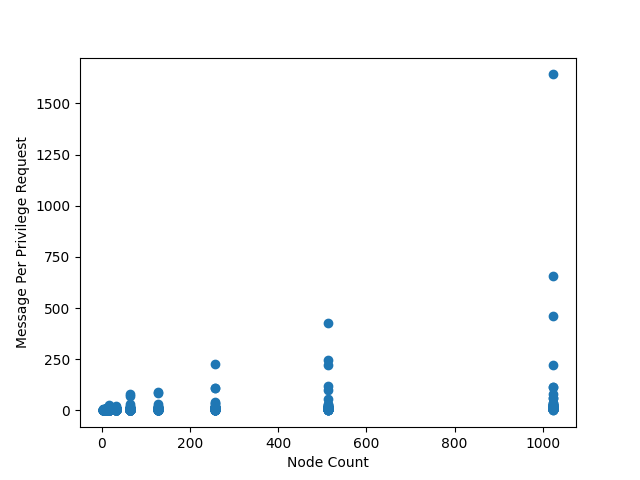
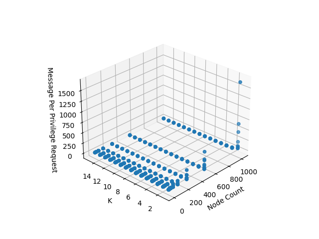

.. include:: substitutions.rst

Implementation, Results and Discussion
======================================

Implementation and Methodology
~~~~~~~~~~~~~~~~~~~~~~~~~~~~~~~~~~~~

To implement the algorithm, we utilized an event-driven node from the adhoccomputing library. These nodes operate with an internal event queue.

Communication between nodes occurs via channels, which essentially represent the connections between them.

The algorithm comprises four main types of events:

1. Requesting privilege
2. Releasing privilege
3. Sending request messages
4. Sending reply messages

For a deeper understanding and formal declarations regarding the algorithm, refer to the documentation.

To evaluate the algorithm, we first establish an appropriate network topology. For Raymond's algorithm, a K-ary tree structure is utilized.

Constructing a K-ary topology involves determining the number of nodes and the minimum and maximum number of children for each node.

Starting from the root, nodes are added with a random count of children within the specified range.

Ultimately, our randomized K-ary tree, adhering to the given constraints, is ready for use.

Key Notes:

1. When both the minimum and maximum number of nodes are set to 1, the topology behaves like a linked list.

2. Setting both values to 2 results in a binary tree-like behavior.

After setting up the topology, all nodes are activated.

Subsequently, randomly selected nodes initiate requests for privilege, with timing following a Poisson distribution.

The testing process waits for all nodes to no longer require privilege.

Finally, data from all nodes is collected and analyzed to derive benchmark results, including:

1. Total privilege requests
2. Instances of duplicated privilege requests
3. Total critical section usage
4. Total critical section releases
5. Count of received request messages
6. Count of received token messages
7. Count of sent request messages
8. Count of sent token messages

The correlation between the total privilege requests and the combined count of request and token messages indicates the message complexity.

Furthermore, the relationship between total privilege requests and total critical section releases serves as practical evidence of absence of starvation and fairness within the system.

Results
~~~~~~~~

Theoretically, in the worst-case scenario, the entire topology is represented as a linked list, and when the bottom node sends a privilege request, a total of 2*(N-1) messages need to be transmitted. To generalize further, in the worst case, the number of messages to be generated in a topology based on a tree between the two nodes farthest apart from each other is twice the distance between them.

In the experiments, the number of children a node can have in the topology is adjusted to be at least 1 and at most 16. The number of nodes in the experiments is in powers of 2.

The above figure illustrates the graph of the total number of messages per privilege request against the number of nodes in the topology on the horizontal axis and the total number of messages per privilege request on the vertical axis.

As observed, the number of messages per privilege request has not exceeded the value of 2*(N-1), and it approaches the value of logN.

The above figure illustrates the relationship between the number of nodes in the topology and the number of messages per privilege request for a fully populated k-ary tree, where k is the number of children per node.

As seen, when k equals 1, the system operates like a linked list, not exceeding the number of messages at 2*(N-1). As k increases, the number of messages approaches logK(N).

Discussion
~~~~~~~~~~

In conclusion, we observe an algorithm where the number of messages is determined based on the structure of the topology, but the average density converges to approximately logK(N). We can observe that each node in the topology can accumulate up to K requests in its memory. It is a preferable algorithm in terms of message and memory complexity. However, if any node within the topology fails, it prevents all nodes below it from obtaining privileges. If the root node fails, only the nodes within the branch where the root node is located can have privileges. When K is large, the number of affected nodes increases. Conversely, when K decreases, the distance between the two farthest nodes increases, leading to an increase in the average number of messages per privilege request.